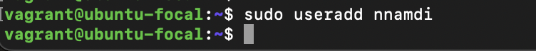

# 10 Linux Commands


## file command

The file command lets you check a file type – whether it is a text, image, or binary.
Here’s the basic syntax:

```bash
file filename
```

The image below shows me checking the file type for `altschool-test.txt`.


## ping command

It lets you check whether a network or server is reachable, which is useful for troubleshooting connectivity issues.
Here’s the basic syntax:

```bash
ping [option] URL_OR_IP_Address
```

For example, run the following to check the connection and response time to Google:


## curl command

The curl command transfers data between servers. Its common usage is for retrieving a web page’s content to your system using its URL.
Here’s the basic syntax:

```bash
curl [option] URL
```

The image below  shows me retrieving data from `learn.altschool.com`


## grep command

The global regular expression or grep command lets you find a word by searching the content of a file. This Linux command prints all lines containing the matching strings, which is useful for filtering large log files. The image below shows searching for the word `Cloud` in the file `altschool-test.txt`.


## hostname command

Run the hostname command to display the system’s hostname/IP address.
Here’s the basic syntax:

```bash
hostname [option]
```

 The image below shows me checking for my system's IP addressusingthe `-i` option.


## chmod command

The chmod command modifies directory or file permissions in Linux.
Here’s the basic syntax:

```bash
chmod [option] [permission] [file_name]
```

Each file is associated with three user classes – `owner`, `group member`, and `others`. It also has three permissions – `read`, `write`, and `execute`.
The image below shows me granting read, write and execute access to all users.


## tee command

The tee command writes the user’s input to Terminal’s output and files.
Here’s the basic syntax:

```bash
command | tee [option] filename
```

For example, the following pings Google and prints the output in Terminal, result.txt


## find command

Use the find command to search for files within a specific directory.
Here’s the basic syntax:

```bash
find [option] [path] [expression]
```

For example, to find a file called result.txt within the `/home/vagrant` folder


## sudo command

Superuser do or sudo is one of the most basic commands in Linux. It runs your command with administrative or root permissions.
Here’s the basic syntax:

```bash
sudo (command)
```

For example, to  run `useradd` command with superuser privileges.


## useradd command

Use useradd to create a new Linux user account. It usually requires superuser privileges.
Here’s the basic syntax:

```bash
useradd [option] username
```

For example, running `useradd` command without superuser privileges:
